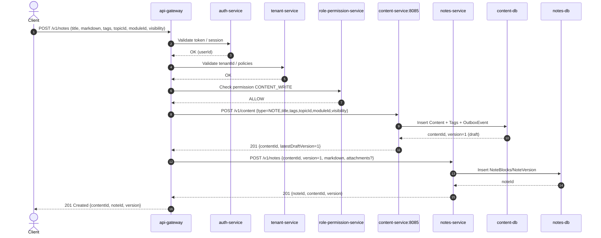

```mermaid
sequenceDiagram
  autonumber
  actor Client
  participant GW as api-gateway
  participant AUTH as auth-service
  participant TEN as tenant-service
  participant RBAC as role-permission-service
  participant CS as content-service:8085
  participant NS as notes-service
  participant CDB as content-db
  participant NDB as notes-db

  Client->>GW: POST /v1/notes (title, markdown, tags, topicId, moduleId, visibility)
  GW->>AUTH: Validate token / session
  AUTH-->>GW: OK (userId)
  GW->>TEN: Validate tenantId / policies
  TEN-->>GW: OK
  GW->>RBAC: Check permission CONTENT_WRITE
  RBAC-->>GW: ALLOW

  GW->>CS: POST /v1/content {type=NOTE,title,tags,topicId,moduleId,visibility}
  CS->>CDB: Insert Content + Tags + OutboxEvent
  CDB-->>CS: contentId, version=1 (draft)
  CS-->>GW: 201 {contentId, latestDraftVersion=1}

  GW->>NS: POST /v1/notes {contentId, version=1, markdown, attachments?}
  NS->>NDB: Insert NoteBlocks/NoteVersion
  NDB-->>NS: noteId
  NS-->>GW: 201 {noteId, contentId, version}

  GW-->>Client: 201 Created {contentId, noteId, version}

```