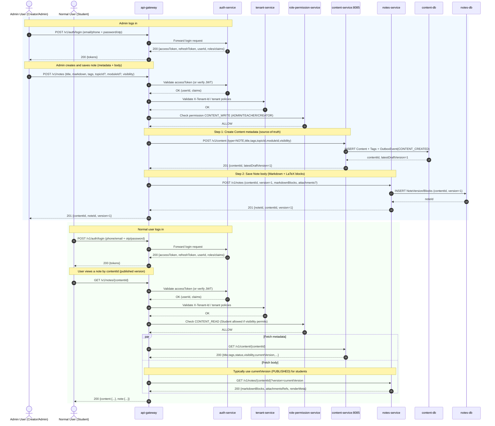

```mermaid

sequenceDiagram
  autonumber
  actor Admin as Admin User (Creator/Admin)
  actor User as Normal User (Student)
  participant GW as api-gateway
  participant AUTH as auth-service
  participant TEN as tenant-service
  participant RBAC as role-permission-service
  participant CS as content-service:8085
  participant NS as notes-service
  participant CDB as content-db
  participant NDB as notes-db

  %% =========================
  %% ADMIN FLOW: Login + Create/Save Note
  %% =========================
  rect rgba(200, 230, 255, 0.25)
    note over Admin,AUTH: Admin logs in
    Admin->>GW: POST /v1/auth/login (email/phone + password/otp)
    GW->>AUTH: Forward login request
    AUTH-->>GW: 200 {accessToken, refreshToken, userId, roles/claims}
    GW-->>Admin: 200 {tokens}

    note over Admin,GW: Admin creates and saves note (metadata + body)
    Admin->>GW: POST /v1/notes (title, markdown, tags, topicId?, moduleId?, visibility)
    GW->>AUTH: Validate accessToken (or verify JWT)
    AUTH-->>GW: OK (userId, claims)

    GW->>TEN: Validate X-Tenant-Id / tenant policies
    TEN-->>GW: OK

    GW->>RBAC: Check permission CONTENT_WRITE (ADMIN/TEACHER/CREATOR)
    RBAC-->>GW: ALLOW

    note over GW,CS: Step 1: Create Content metadata (source-of-truth)
    GW->>CS: POST /v1/content (type=NOTE,title,tags,topicId,moduleId,visibility)
    CS->>CDB: INSERT Content + Tags + OutboxEvent(CONTENT_CREATED)
    CDB-->>CS: contentId, latestDraftVersion=1
    CS-->>GW: 201 {contentId, latestDraftVersion=1}

    note over GW,NS: Step 2: Save Note body (Markdown + LaTeX blocks)
    GW->>NS: POST /v1/notes (contentId, version=1, markdownBlocks, attachments?)
    NS->>NDB: INSERT NoteVersion/Blocks (contentId, version=1)
    NDB-->>NS: noteId
    NS-->>GW: 201 {noteId, contentId, version=1}

    GW-->>Admin: 201 {contentId, noteId, version=1}
  end

  %% =========================
  %% NORMAL USER FLOW: Login + View Note
  %% =========================
  rect rgba(220, 255, 220, 0.25)
    note over User,AUTH: Normal user logs in
    User->>GW: POST /v1/auth/login (phone/email + otp/password)
    GW->>AUTH: Forward login request
    AUTH-->>GW: 200 {accessToken, refreshToken, userId, roles/claims}
    GW-->>User: 200 {tokens}

    note over User,GW: User views a note by contentId (published version)
    User->>GW: GET /v1/notes/{contentId}
    GW->>AUTH: Validate accessToken (or verify JWT)
    AUTH-->>GW: OK (userId, claims)

    GW->>TEN: Validate X-Tenant-Id / tenant policies
    TEN-->>GW: OK

    GW->>RBAC: Check CONTENT_READ (Student allowed if visibility permits)
    RBAC-->>GW: ALLOW

    par Fetch metadata
      GW->>CS: GET /v1/content/{contentId}
      CS-->>GW: 200 {title,tags,status,visibility,currentVersion,...}
    and Fetch body
      note over GW,NS: Typically use currentVersion (PUBLISHED) for students
      GW->>NS: GET /v1/notes/{contentId}?version=currentVersion
      NS-->>GW: 200 {markdownBlocks, attachmentsRefs, renderMeta}
    end

    GW-->>User: 200 {content:{...}, note:{...}}
  end

```