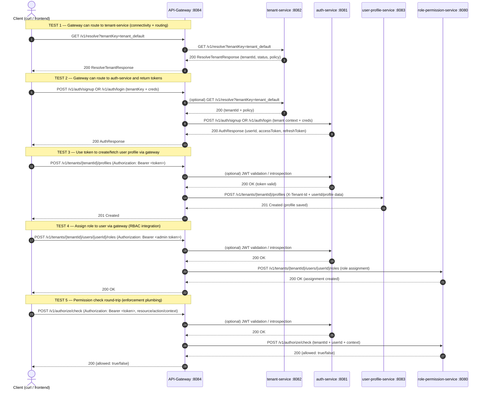

```mermaid


sequenceDiagram
autonumber
actor Client as Client (curl / frontend)
participant GW as API-Gateway :8084
participant TEN as tenant-service :8082
participant AUTH as auth-service :8081
participant PROF as user-profile-service :8083
participant RBAC as role-permission-service :8080

    Note over Client,GW: TEST 1 — Gateway can route to tenant-service (connectivity + routing)
    Client->>GW: GET /v1/resolve?tenantKey=tenant_default
    GW->>TEN: GET /v1/resolve?tenantKey=tenant_default
    TEN-->>GW: 200 ResolveTenantResponse (tenantId, status, policy)
    GW-->>Client: 200 ResolveTenantResponse

    Note over Client,GW: TEST 2 — Gateway can route to auth-service and return tokens
    Client->>GW: POST /v1/auth/signup OR /v1/auth/login (tenantKey + creds)
    GW->>TEN: (optional) GET /v1/resolve?tenantKey=tenant_default
    TEN-->>GW: 200 (tenantId + policy)
    GW->>AUTH: POST /v1/auth/signup OR /v1/auth/login (tenant context + creds)
    AUTH-->>GW: 200 AuthResponse (userId, accessToken, refreshToken)
    GW-->>Client: 200 AuthResponse

    Note over Client,GW: TEST 3 — Use token to create/fetch user profile via gateway
    Client->>GW: POST /v1/tenants/{tenantId}/profiles (Authorization: Bearer <token>)
    GW->>AUTH: (optional) JWT validation / introspection
    AUTH-->>GW: 200 OK (token valid)
    GW->>PROF: POST /v1/tenants/{tenantId}/profiles (X-Tenant-Id + userId/profile data)
    PROF-->>GW: 201 Created (profile saved)
    GW-->>Client: 201 Created

    Note over Client,GW: TEST 4 — Assign role to user via gateway (RBAC integration)
    Client->>GW: POST /v1/tenants/{tenantId}/users/{userId}/roles (Authorization: Bearer <admin token>)
    GW->>AUTH: (optional) JWT validation / introspection
    AUTH-->>GW: 200 OK
    GW->>RBAC: POST /v1/tenants/{tenantId}/users/{userId}/roles (role assignment)
    RBAC-->>GW: 200 OK (assignment created)
    GW-->>Client: 200 OK

    Note over Client,GW: TEST 5 — Permission check round-trip (enforcement plumbing)
    Client->>GW: POST /v1/authorize/check (Authorization: Bearer <token>, resource/action/context)
    GW->>AUTH: (optional) JWT validation / introspection
    AUTH-->>GW: 200 OK
    GW->>RBAC: POST /v1/authorize/check (tenantId + userId + context)
    RBAC-->>GW: 200 {allowed: true/false}
    GW-->>Client: 200 {allowed: true/false}
```