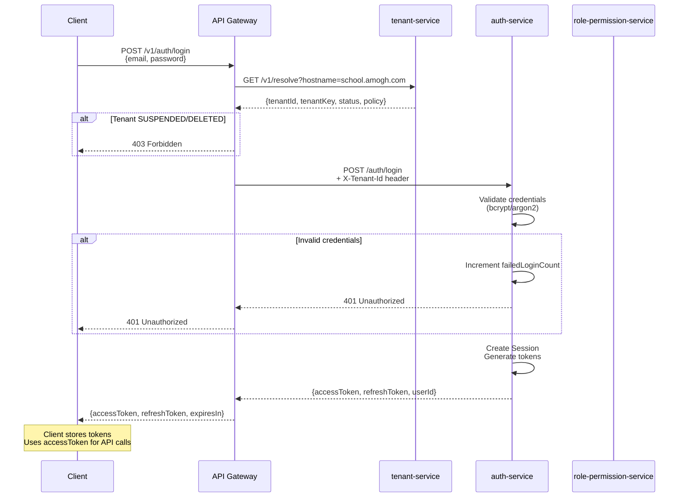
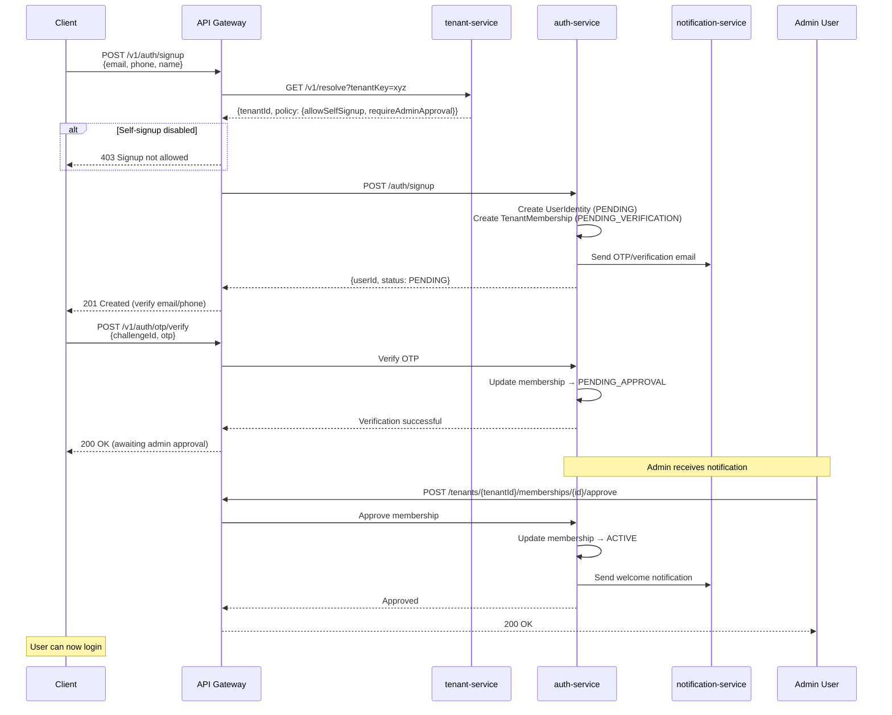
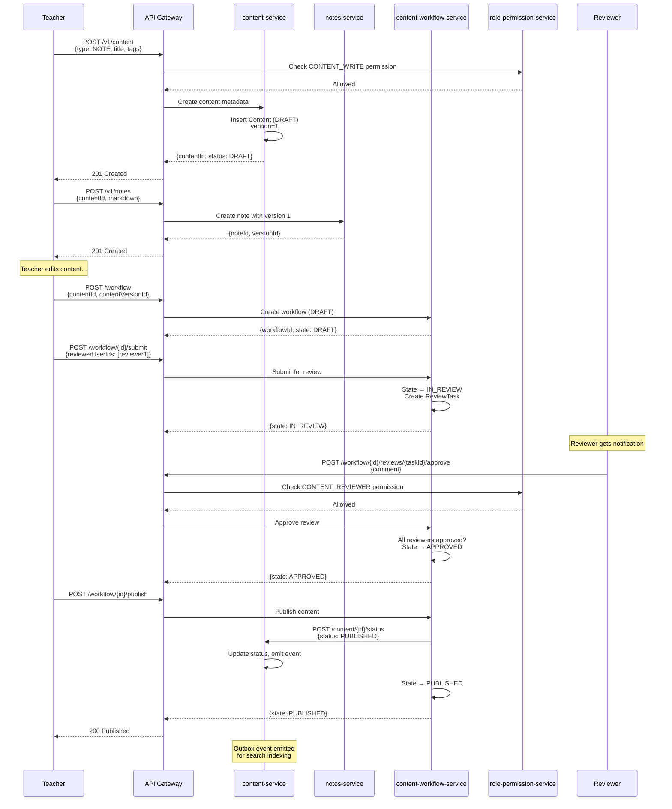
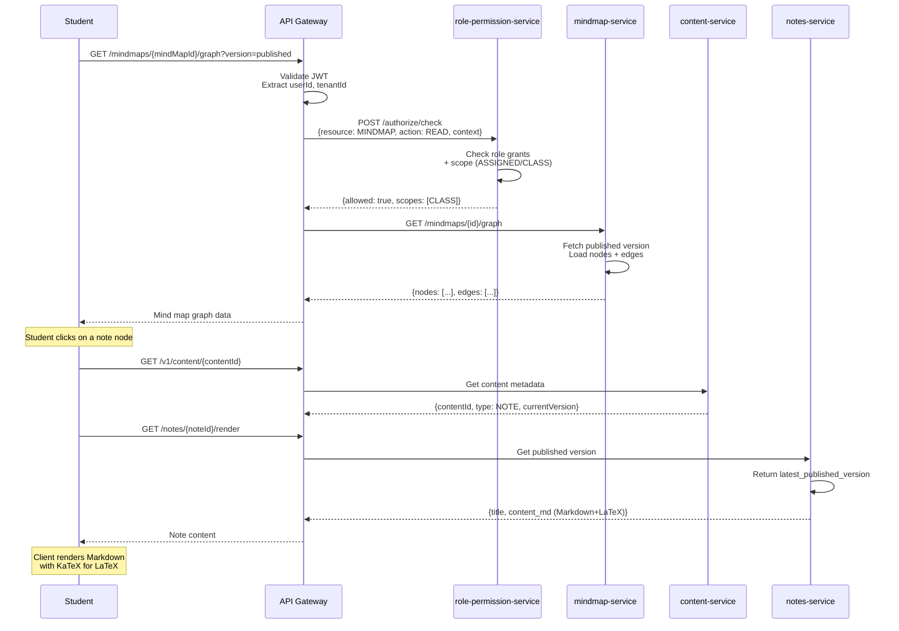
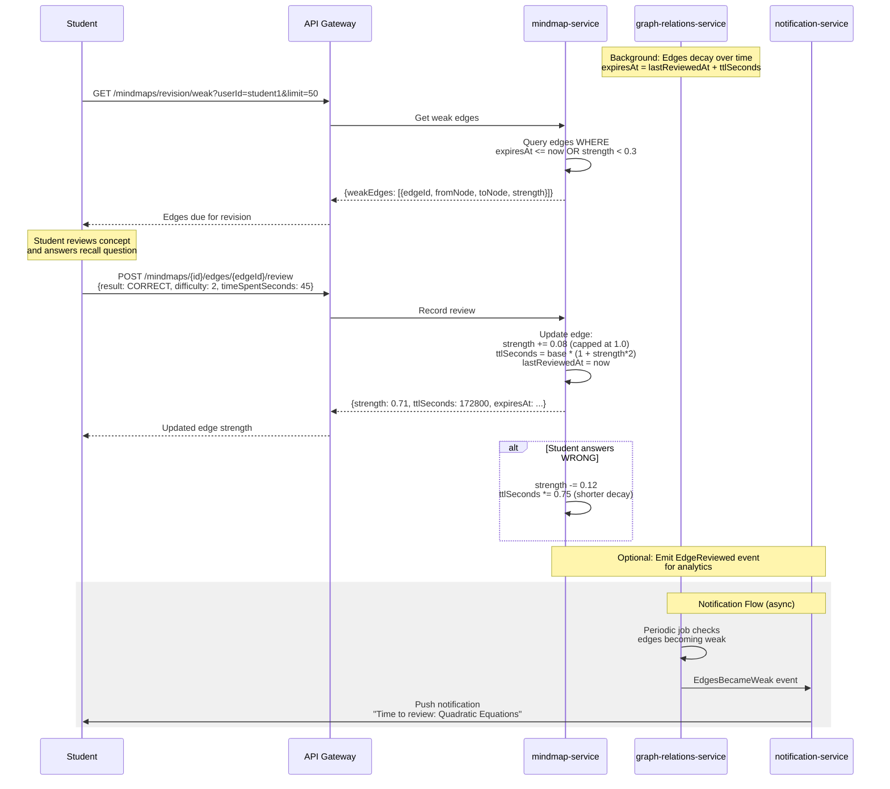
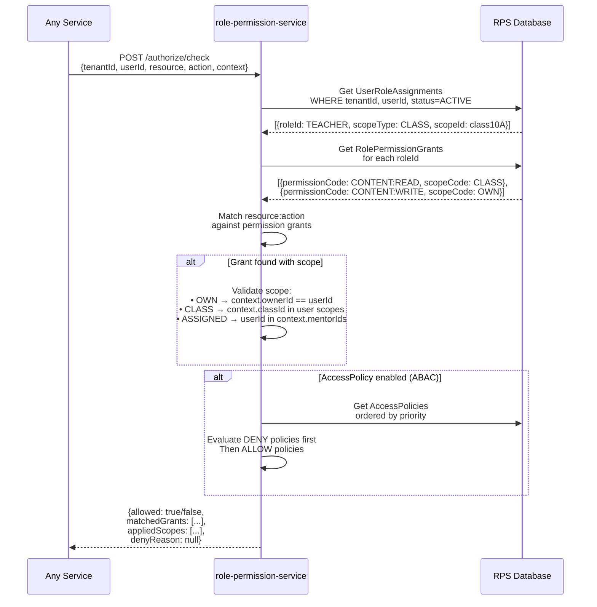
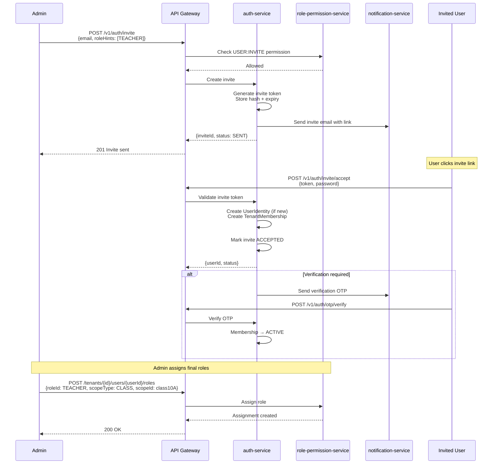

# Amogh Project - Architecture Summary

## Overview

**Amogh** is a multi-tenant learning platform designed for schools and tuition organizations in India. It provides learning content management, mind maps with spaced repetition, and comprehensive user management with role-based access control.

---

## Microservices Architecture

```
┌─────────────────────────────────────────────────────────────────────────────┐
│                              CLIENTS (Web/Mobile)                            │
└─────────────────────────────────────────────────────────────────────────────┘
                                       │
                                       ▼
┌─────────────────────────────────────────────────────────────────────────────┐
│                              API GATEWAY                                     │
│  • JWT Validation  • Tenant Resolution  • Rate Limiting  • Routing          │
└─────────────────────────────────────────────────────────────────────────────┘
                                       │
        ┌──────────────┬───────────────┼───────────────┬──────────────┐
        ▼              ▼               ▼               ▼              ▼
┌──────────────┐ ┌──────────────┐ ┌──────────────┐ ┌──────────────┐ ┌──────────────┐
│ auth-service │ │tenant-service│ │role-permission│ │user-profile  │ │content-service│
│              │ │              │ │   -service   │ │   -service   │ │              │
└──────────────┘ └──────────────┘ └──────────────┘ └──────────────┘ └──────────────┘
                                       │
        ┌──────────────┬───────────────┼───────────────┬──────────────┐
        ▼              ▼               ▼               ▼              ▼
┌──────────────┐ ┌──────────────┐ ┌──────────────┐ ┌──────────────┐
│content-workflow│ │mindmap-service│ │graph-relations│ │notes-service │
│   -service   │ │              │ │   -service   │ │              │
└──────────────┘ └──────────────┘ └──────────────┘ └──────────────┘
```

---

## Service Summary Table

| Service | Port | Purpose | Database |
|---------|------|---------|----------|
| **api-gateway** | - | Single entry point, JWT validation, tenant resolution, rate limiting | Optional (stateless) |
| **auth-service** | - | Identity management, authentication, tokens, sessions | PostgreSQL |
| **tenant-service** | - | Tenant lifecycle, policies, branding, domain mapping | PostgreSQL |
| **user-profile-service** | - | User profiles, preferences, relationships | PostgreSQL |
| **role-permission-service** | - | RBAC/ABAC authorization, role/permission management | PostgreSQL |
| **content-service** | 8085 | Content metadata catalog (notes/modules/topics) | PostgreSQL |
| **content-workflow-service** | 8086 | Git-like approval workflow (draft→review→publish) | PostgreSQL |
| **mindmap-service** | - | Mind maps, nodes, edges with strength/TTL | PostgreSQL |
| **graph-relations-service** | 8087 | Learning graph relations, edge reinforcement | PostgreSQL |
| **notes-service** | 8088 | Note content (Markdown + LaTeX), versioning | PostgreSQL |

---

## Core Concepts

### Multi-Tenancy
- Every record is scoped by `tenant_id`
- Tenant resolved via hostname/subdomain or path prefix
- Headers: `X-Tenant-Id`, `X-User-Id`, `X-Request-Id`

### Authentication Model
- JWT-based (Access token + Refresh token)
- Methods: Email+Password, Phone+OTP
- Sessions tracked for logout/device management

### Authorization Model
- RBAC with optional ABAC policies
- Scopes: OWN, ASSIGNED, CLASS, TENANT
- System roles: SUPER_ADMIN, TENANT_ADMIN, TEACHER/CREATOR, MENTOR, STUDENT, PARENT

### Content Lifecycle
- States: DRAFT → IN_REVIEW → APPROVED → PUBLISHED → ARCHIVED
- Versioning for notes and mind maps
- Approval workflow with reviewer assignments

### Learning Graph (Amogh Logic)
- Edge strength (0..1) represents mastery
- TTL (time-to-live) for spaced repetition
- Edges decay over time, strengthen after recall

---

## Sequence Diagrams

### Use Case 1: User Login Flow



### Use Case 2: User Signup with Admin Approval



### Use Case 3: Content Creation and Publishing Workflow



### Use Case 4: Mind Map Access for Students



### Use Case 5: Spaced Repetition - Edge Review and Decay



### Use Case 6: Permission Check Flow (Authorization)



### Use Case 7: Invite-Based Onboarding



---

## Data Flow Summary

### Headers Propagated Through System
```
Client Request
    │
    ▼
API Gateway
    │ Resolves tenant, validates JWT
    │ Injects: X-Tenant-Id, X-User-Id, X-Request-Id
    ▼
Downstream Services
    │ Use headers for:
    │ • Tenant isolation (filter all queries)
    │ • Audit logging
    │ • Request correlation
    ▼
Database (PostgreSQL)
    All tables have tenant_id column
```

### Event Flow (Outbox Pattern)
```
Service writes to DB
    │
    ▼ (same transaction)
Outbox table entry
    │
    ▼ (async poller or webhook)
Event consumers
    │
    ├── Search indexing
    ├── Notification triggers
    ├── Cache invalidation
    └── Analytics
```

---

## Key Integration Points

| From | To | Purpose |
|------|-----|---------|
| api-gateway | tenant-service | Resolve tenant from hostname/key |
| api-gateway | auth-service | Token introspection (optional) |
| auth-service | tenant-service | Read tenant policies |
| auth-service | notification-service | Send OTP/invite emails |
| content-workflow-service | content-service | Publish content version |
| content-workflow-service | role-permission-service | Check reviewer permissions |
| mindmap-service | content-service | Link nodes to content |
| notes-service | content-workflow-service | Publish note versions |
| All services | role-permission-service | Authorization checks |

---

## Technology Stack

- **Language**: Java 17/21+
- **Framework**: Spring Boot 3.x/4.x
- **Gateway**: Spring Cloud Gateway (Reactive)
- **Database**: PostgreSQL
- **Migrations**: Flyway / Liquibase
- **ORM**: Spring Data JPA (Hibernate)
- **Auth**: JWT (with JWKS)
- **API Style**: REST + JSON (versioned under `/v1`)
- **Observability**: Micrometer + Actuator + distributed tracing
- **Code Generation**: Lombok

---

## Security Highlights

1. **Password Hashing**: Argon2id or bcrypt
2. **OTP Policies**: 5-min expiry, max 5 attempts, resend cooldown
3. **Rate Limiting**: IP + identifier for auth routes
4. **Account Lockouts**: After repeated failures
5. **Token Rotation**: Refresh token reuse detection
6. **Tenant Isolation**: All queries filter by tenant_id
7. **Audit Trail**: All sensitive actions logged

---

## MVP System Roles

| Role | Capabilities |
|------|-------------|
| SUPER_ADMIN | Platform-wide access, manage all tenants |
| TENANT_ADMIN | Manage tenant settings, users, roles |
| TEACHER/CREATOR | Create/edit content, mind maps |
| MENTOR | View assigned student progress |
| STUDENT | Read published content, review edges |
| PARENT | View linked child's progress |

---

*Generated from context files in the Amogh Project*
