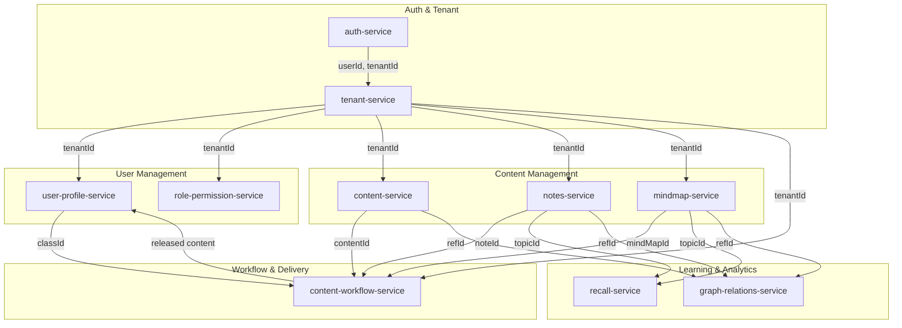

# Entity Relationship Diagram - Learner Microservices

## Overview
This document contains the complete ER diagram for all microservices in the Learner platform.

---

## Complete ER Diagram (Mermaid)

```mermaid
erDiagram
    %% ==================== AUTH-SERVICE ====================
    UserIdentity {
        UUID id PK
        String primaryEmail
        String primaryPhone
        Boolean emailVerified
        Boolean phoneVerified
        String passwordHash
        Enum status
        Instant createdAt
        Instant updatedAt
        Instant lastLoginAt
    }

    Credential {
        UUID id PK
        UUID userId FK
        Enum type
        String secretRef
        Enum status
        Instant createdAt
    }

    TenantMembership {
        UUID id PK
        UUID tenantId FK
        UUID userId FK
        Enum status
        Enum joinMethod
        Instant createdAt
        UUID approvedBy
    }

    Session {
        UUID id PK
        UUID userId FK
        UUID tenantId FK
        String refreshTokenHash
        String deviceId
        Instant expiresAt
        Instant revokedAt
    }

    Invite {
        UUID id PK
        UUID tenantId FK
        String emailOrPhone
        Enum status
        String tokenHash
        Instant expiresAt
        UUID invitedBy
    }

    VerificationChallenge {
        UUID id PK
        UUID userId FK
        UUID tenantId FK
        Enum channel
        Enum purpose
        String otpHash
        Instant expiresAt
    }

    UserIdentity ||--o{ Credential : "has"
    UserIdentity ||--o{ TenantMembership : "belongs to"
    UserIdentity ||--o{ Session : "has"
    UserIdentity ||--o{ VerificationChallenge : "has"

    %% ==================== TENANT-SERVICE ====================
    Tenant {
        UUID id PK
        String tenantKey UK
        String name
        Enum status
        Instant createdAt
        Long version
    }

    TenantBranding {
        UUID id PK
        UUID tenantId FK
        String displayName
        String logoUrl
        String primaryColor
        String accentColor
    }

    TenantDomainMapping {
        UUID id PK
        UUID tenantId FK
        String hostname UK
        Enum type
        Boolean verified
    }

    TenantPlan {
        UUID id PK
        UUID tenantId FK
        Enum planCode
        Integer maxUsers
        Integer maxStorageMb
    }

    TenantPolicy {
        UUID id PK
        UUID tenantId FK
        Boolean allowSelfSignup
        Boolean requireAdminApproval
        Integer sessionMaxDays
    }

    Tenant ||--|| TenantBranding : "has"
    Tenant ||--o{ TenantDomainMapping : "has"
    Tenant ||--|| TenantPlan : "has"
    Tenant ||--|| TenantPolicy : "has"
    Tenant ||--o{ TenantMembership : "has members"
    Tenant ||--o{ Invite : "has"

    %% ==================== USER-PROFILE-SERVICE ====================
    UserProfile {
        UUID id PK
        UUID tenantId FK
        UUID userId FK
        String displayName
        String firstName
        String lastName
        String email
        Enum userType
        Enum status
        Long version
    }

    StudentProfile {
        UUID id PK
        UUID tenantId FK
        UUID userId FK
        String grade
        String section
        String rollNumber
        UUID classId FK
        String board
    }

    UserPreference {
        UUID id PK
        UUID tenantId FK
        UUID userId FK
        String language
        String timezone
        Boolean notificationsEnabled
    }

    UserRelationship {
        UUID id PK
        UUID tenantId FK
        UUID userId FK
        UUID relatedUserId FK
        Enum relationshipType
    }

    UserProfile ||--o| StudentProfile : "may have"
    UserProfile ||--|| UserPreference : "has"
    UserProfile ||--o{ UserRelationship : "has"

    %% ==================== CONTENT-WORKFLOW-SERVICE ====================
    SchoolClass {
        UUID id PK
        String tenantId FK
        String name
        String subject
        String grade
        String description
        Integer studentCount
        Long version
    }

    TeacherClassAssignment {
        UUID id PK
        String tenantId FK
        UUID teacherId FK
        UUID classId FK
        Instant assignedAt
        String assignedBy
    }

    Workflow {
        UUID id PK
        String tenantId FK
        String contentId FK
        String contentVersionId
        String titleSnapshot
        Enum state
        Integer requiredApprovals
        String currentStep
        Long version
    }

    ReviewTask {
        UUID id PK
        UUID workflowId FK
        String assigneeUserId
        Enum status
        String comment
        Instant createdAt
    }

    ChangeRequest {
        UUID id PK
        UUID workflowId FK
        String requestedByUserId
        String summary
        String details
        Enum status
    }

    ReleasedContent {
        UUID id PK
        String tenantId FK
        UUID contentId FK
        String contentType
        UUID classId FK
        UUID releasedBy
        Instant releasedAt
    }

    SchoolClass ||--o{ TeacherClassAssignment : "has"
    SchoolClass ||--o{ ReleasedContent : "receives"
    SchoolClass ||--o{ StudentProfile : "has students"
    Workflow ||--o{ ReviewTask : "has"
    Workflow ||--o{ ChangeRequest : "has"

    %% ==================== NOTES-SERVICE ====================
    Note {
        UUID id PK
        UUID tenantId FK
        String title
        String summary
        Enum status
        UUID createdBy
        UUID latestVersionId FK
        Enum scopeType
        UUID scopeId
        Boolean deleted
    }

    NoteVersion {
        UUID id PK
        UUID tenantId FK
        UUID noteId FK
        Integer versionNo
        String contentMd
        String contentHash
        String contentGuidedJson
        String changeSummary
        UUID createdBy
    }

    NoteTag {
        UUID id PK
        UUID tenantId FK
        UUID noteId FK
        String tag
    }

    Note ||--o{ NoteVersion : "has"
    Note ||--o{ NoteTag : "has"
    Note ||--o{ ReleasedContent : "released as"

    %% ==================== MINDMAP-SERVICE ====================
    MindMap {
        UUID mindMapId PK
        String tenantId FK
        String title
        String description
        String subject
        String grade
        Enum status
        Enum visibility
        UUID publishedVersionId FK
        Long lockVersion
    }

    MindMapVersion {
        UUID mindMapVersionId PK
        UUID mindMapId FK
        Integer versionNumber
        Enum status
        UUID createdBy
    }

    MindMapNode {
        UUID nodeId PK
        String tenantId FK
        UUID mindMapId FK
        Enum type
        String title
        String bodyMarkdown
        Double posX
        Double posY
    }

    MindMapEdge {
        UUID edgeId PK
        String tenantId FK
        UUID mindMapId FK
        UUID fromNodeId FK
        UUID toNodeId FK
        Enum relation
        Double weight
    }

    MindMap ||--o{ MindMapVersion : "has"
    MindMap ||--o{ MindMapNode : "contains"
    MindMap ||--o{ MindMapEdge : "contains"
    MindMapNode ||--o{ MindMapEdge : "connects from"
    MindMapNode ||--o{ MindMapEdge : "connects to"

    %% ==================== CONTENT-SERVICE ====================
    Content {
        UUID id PK
        String tenantId FK
        Enum type
        String title
        String description
        Enum status
        Integer currentVersion
        Enum visibility
        UUID topicId
        UUID moduleId
        Boolean deleted
    }

    ContentTag {
        UUID id PK
        String tenantId FK
        UUID contentId FK
        String tag
    }

    OutboxEvent {
        UUID id PK
        String tenantId FK
        String aggregateType
        UUID aggregateId
        String eventType
        String payloadJson
        Enum status
    }

    Content ||--o{ ContentTag : "has"
    Content ||--o{ Workflow : "triggers"
    Content ||--o{ OutboxEvent : "produces"

    %% ==================== ROLE-PERMISSION-SERVICE ====================
    Permission {
        Long id PK
        String code UK
        String resource
        String action
        String description
        Boolean isDeprecated
    }

    PermissionScope {
        Long id PK
        String code UK
        String description
    }

    Role {
        Long id PK
        String tenantId FK
        String name
        String description
        Boolean isSystem
        String status
    }

    RolePermissionGrant {
        Long id PK
        String tenantId FK
        Long roleId FK
        String permissionCode FK
        String scopeCode FK
        String constraintsJson
    }

    UserRoleAssignment {
        Long id PK
        String tenantId FK
        String userId FK
        Long roleId FK
        String scopeType
        String scopeId
        String status
        Instant validFrom
        Instant validTo
    }

    AccessPolicy {
        Long id PK
        String tenantId FK
        String name
        String effect
        Integer priority
        String resource
        String action
        String conditionJson
    }

    Role ||--o{ RolePermissionGrant : "has"
    Role ||--o{ UserRoleAssignment : "assigned to"
    Permission ||--o{ RolePermissionGrant : "granted via"
    PermissionScope ||--o{ RolePermissionGrant : "scoped by"

    %% ==================== RECALL-SERVICE ====================
    RecallSchedule {
        UUID id PK
        UUID tenantId FK
        UUID userId FK
        UUID topicId FK
        Enum lastOption
        Long intervalSeconds
        Instant nextReviewAt
        Integer streak
        Double easeFactor
    }

    RecallEvent {
        UUID id PK
        UUID tenantId FK
        UUID userId FK
        UUID topicId FK
        Enum option
        Integer timeSpentSeconds
        Instant occurredAt
        Long calculatedIntervalSeconds
    }

    RecallSchedule ||--o{ RecallEvent : "logs"

    %% ==================== GRAPH-RELATIONS-SERVICE ====================
    Graph {
        UUID id PK
        UUID tenantId FK
        Enum scopeType
        UUID scopeId
        String name
        String description
        Enum status
    }

    GraphNode {
        UUID id PK
        UUID tenantId FK
        UUID graphId FK
        Enum nodeType
        String refService
        String refType
        UUID refId
        String label
    }

    GraphEdge {
        UUID id PK
        UUID tenantId FK
        UUID graphId FK
        UUID fromNodeId FK
        UUID toNodeId FK
        Enum relationType
        Boolean directed
        Double strength
    }

    EdgeSignal {
        UUID id PK
        UUID tenantId FK
        UUID graphId FK
        UUID edgeId FK
        UUID userId FK
        Enum signalType
        Double signalValue
    }

    Graph ||--o{ GraphNode : "contains"
    Graph ||--o{ GraphEdge : "contains"
    GraphNode ||--o{ GraphEdge : "connects from"
    GraphNode ||--o{ GraphEdge : "connects to"
    GraphEdge ||--o{ EdgeSignal : "receives"
```

---

## Service Database Summary

| Service | Database Name | Main Tables |
|---------|--------------|-------------|
| auth-service | auth_service | user_identities, credentials, tenant_memberships, sessions, invites |
| tenant-service | tenant_service | tenants, tenant_branding, tenant_domain_mappings, tenant_plans, tenant_policies |
| user-profile-service | user_profile | user_profiles, student_profiles, user_preferences, user_relationships |
| content-workflow-service | content_workflow_service | school_classes, teacher_class_assignments, workflows, review_tasks, change_requests, released_content |
| notes-service | notes_service | notes, note_versions, note_tags |
| mindmap-service | mindmap_service | mind_maps, mind_map_versions, nodes, edges |
| content-service | content_service | contents, content_tags, outbox_events |
| role-permission-service | role_permission_service | permissions, permission_scopes, roles, role_permission_grants, user_role_assignments, access_policies |
| recall-service | recall_service | recall_schedule, recall_events |
| graph-relations-service | graph_relations_service | graphs, nodes, edges, edge_signals |

---

## Cross-Service Relationships

---

## Key Design Patterns

1. **Multi-Tenancy**: All tables include `tenant_id` for data isolation
2. **UUID Primary Keys**: Distributed-friendly identifiers
3. **Soft Deletes**: `deleted` boolean flag instead of hard deletes
4. **Optimistic Locking**: `@Version` for concurrent updates
5. **Audit Trail**: `created_at`, `updated_at`, `created_by`, `updated_by`
6. **Event Sourcing**: OutboxEvent table for async messaging
7. **Spaced Repetition**: RecallSchedule with SM-2 algorithm fields
8. **Versioning**: Content and notes have version history tables

---

## Enums Reference

### Auth Service
- AccountStatus: ACTIVE, SUSPENDED, LOCKED, PENDING_VERIFICATION
- CredentialType: PASSWORD, OAUTH, API_KEY
- TenantMembershipStatus: ACTIVE, SUSPENDED, PENDING
- InviteStatus: PENDING, ACCEPTED, EXPIRED, REVOKED

### Tenant Service
- TenantStatus: ACTIVE, SUSPENDED, TRIAL, ARCHIVED
- PlanCode: FREE, BASIC, PREMIUM, ENTERPRISE
- DomainType: PRIMARY, ALIAS, CUSTOM

### User Profile Service
- UserType: STUDENT, TEACHER, PARENT, ADMIN
- ProfileStatus: ACTIVE, INACTIVE, SUSPENDED
- RelationshipType: PARENT_OF, GUARDIAN_OF, SIBLING_OF

### Notes Service
- NoteStatus: DRAFT, IN_REVIEW, READY, RELEASED, ARCHIVED
- NoteScopeType: TENANT, CLASS, PRIVATE

### Content Workflow Service
- WorkflowState: DRAFT, SUBMITTED, IN_REVIEW, APPROVED, REJECTED, PUBLISHED
- ReviewTaskStatus: PENDING, APPROVED, REJECTED, CHANGES_REQUESTED
- ChangeRequestStatus: OPEN, RESOLVED, CLOSED

### Mindmap Service
- MindMapStatus: DRAFT, PUBLISHED, ARCHIVED
- NodeType: TOPIC, SUBTOPIC, CONCEPT, RESOURCE
- EdgeRelation: PARENT_OF, RELATED_TO, PREREQUISITE_OF

### Recall Service
- RecallOption: FORGOT, HARD, GOOD, EASY

